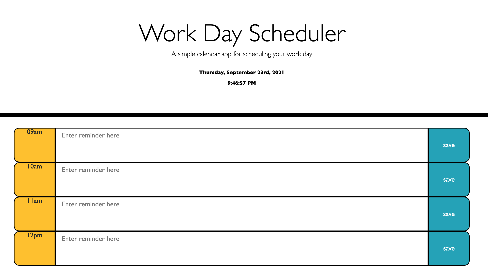
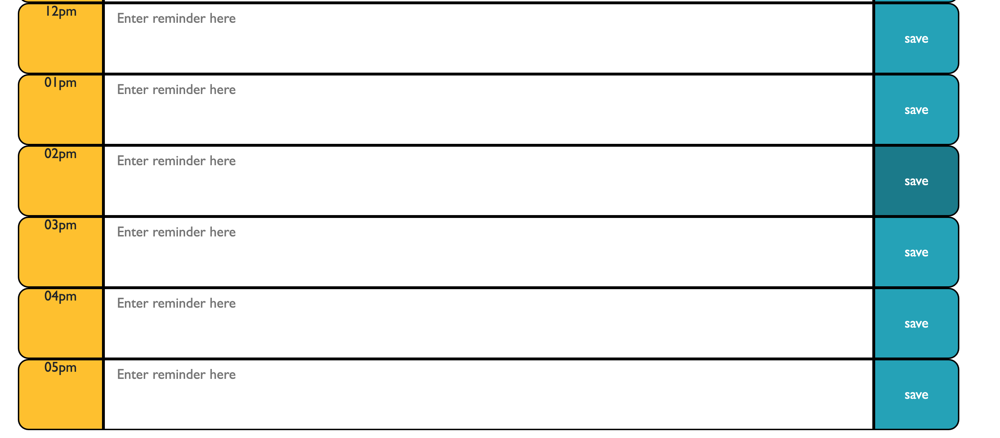

HTML, CSS and Javascript with jquery has been used to complete this homework task.
A planner was created for the current day.
Moment.js has been used to create a header showing the current time and date at the top of the planner.
Hour slots for a typical work day (9am - 5pm) are displayed. 
Events/reminders can be inputted into the desired hours lot, with a save button to save each event/reminder as a list item.
Simple CSS is used to style the planner.
The outline HTML is used more to create containers for the javascript, with some HTML elements create using jquery.
Local storage saves and retrieves any reminders that are saved into the planner.
(I was unable to include a delete button for reminders in the planner, and so they cannot be deleted using this script.js.)

Link to deployed application: https://ahooper00.github.io/homework-05/